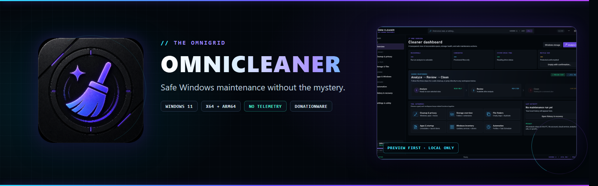
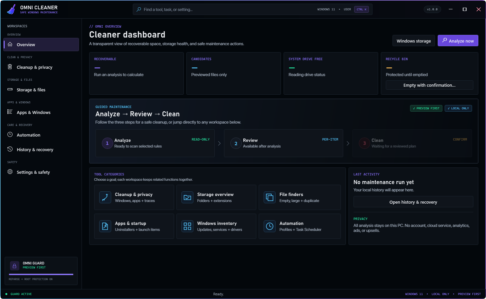
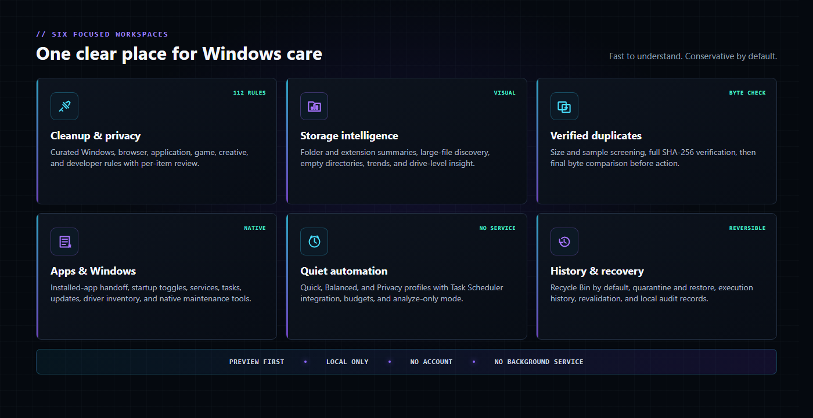
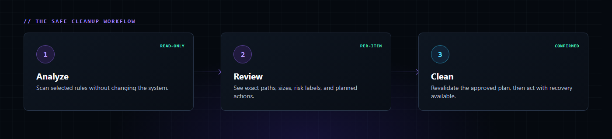
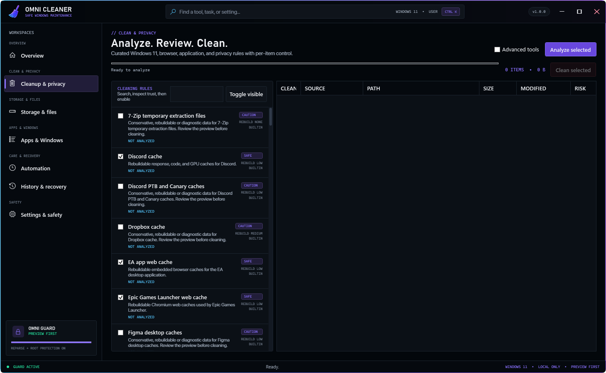
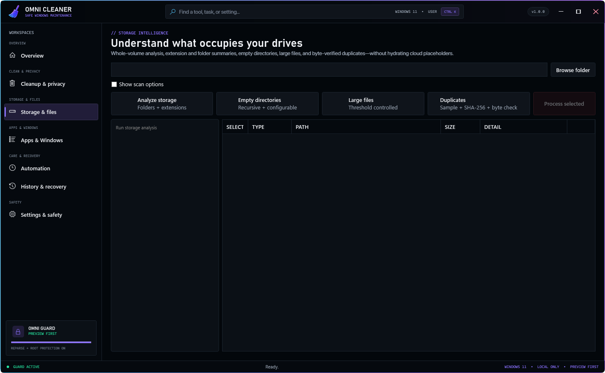
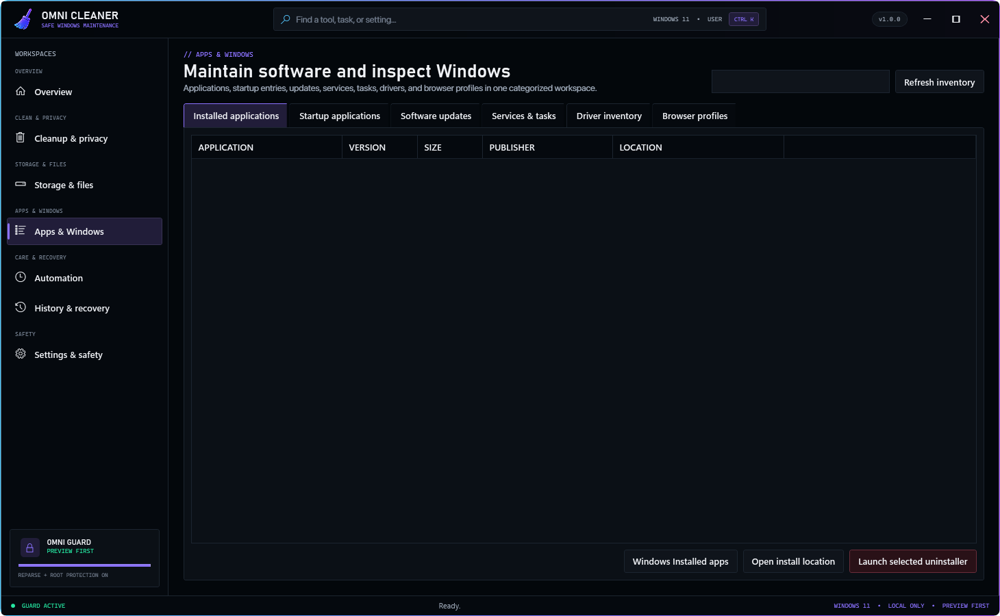
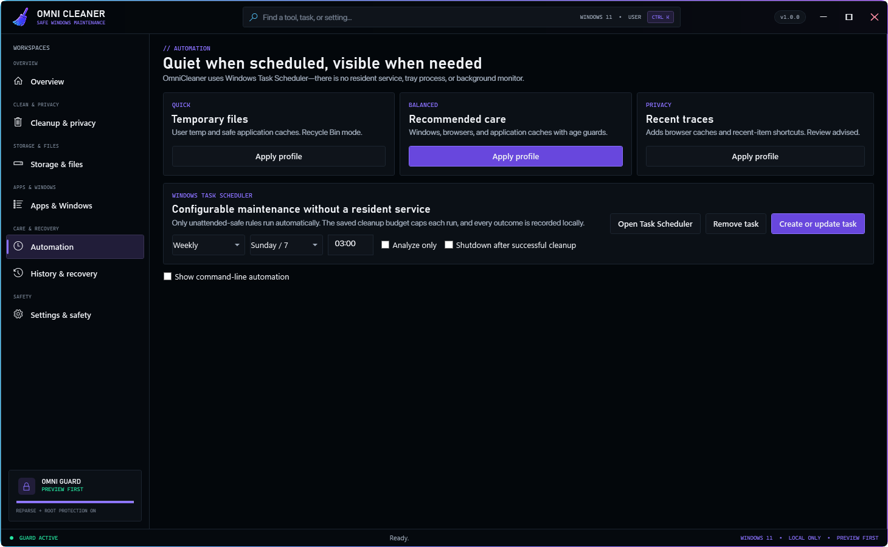
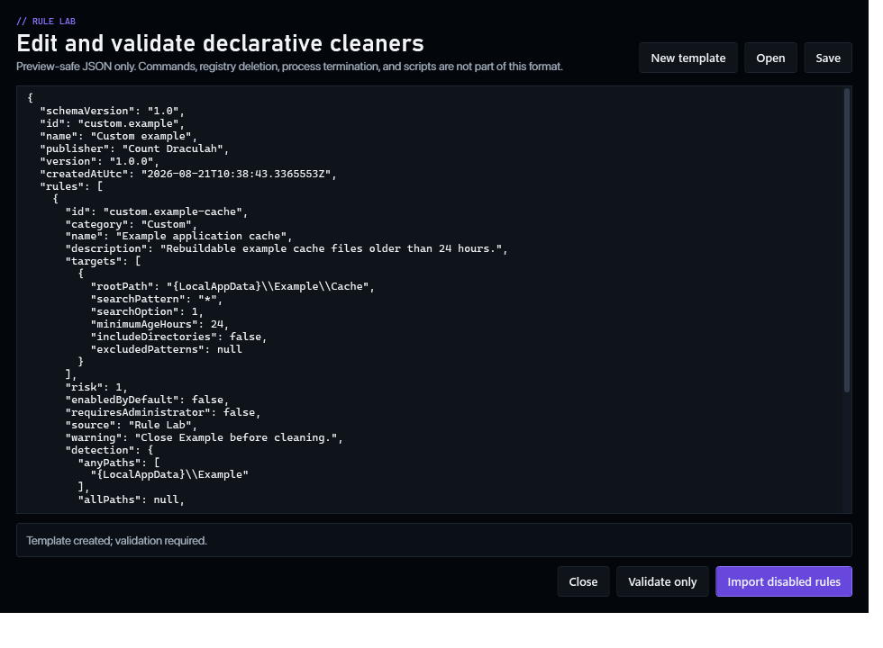
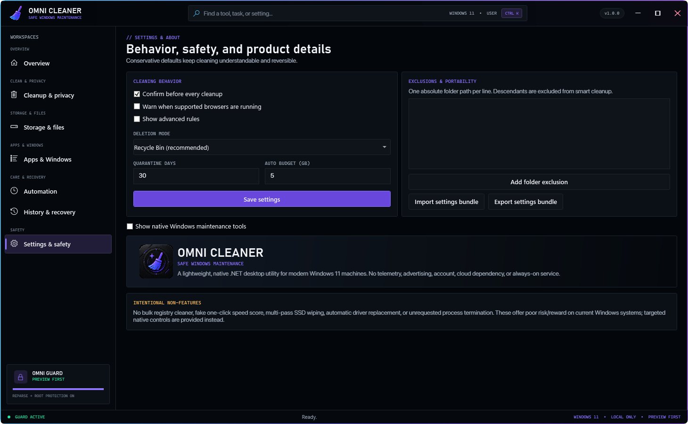

  

  
  
  
  
  

  <a href="#why-omnicleaner">Why OmniCleaner</a> ·
  <a href="#everything-in-one-clear-workspace">Features</a> ·
  <a href="#safety-is-the-feature">Safety</a> ·
  <a href="#see-it-in-action">Screenshots</a> ·
  <a href="#get-omnicleaner">Get OmniCleaner</a> ·
  <a href="#support-the-project">Support</a>

  
  &nbsp;&nbsp;
  

> [!IMPORTANT]
> This is OmniCleaner’s public product and documentation repository. In keeping with the OmniGrid release model, **application source code, installers, portable builds, signing material, and private build infrastructure are deliberately not hosted here**.

## Why OmniCleaner

Most cleanup tools ask for trust before they provide context. OmniCleaner reverses that relationship: analyze first, show the exact plan, let the user review each item, revalidate the plan, and only then perform a confirmed action.

OmniCleaner brings modern Windows cleanup, storage intelligence, file discovery, app maintenance, automation, and recovery into one lightweight Windows 11 desktop experience. It combines the practical breadth people expect from tools such as CCleaner and BleachBit, the Windows-native focus of CleanmgrPlus and FluentCleaner, and the specialist file-finding capabilities of RED-style empty-directory tools—then adds stricter safeguards and a clearer interface.

  

### The product promise

| Principle | What it means in practice |
|---|---|
| **Preview first** | Scanning is read-only. Cleanup becomes available only after a reviewable plan exists. |
| **Understandable** | Clear categories, global feature search, hover help, risk labels, and per-item detail. |
| **Recoverable** | Recycle Bin is the default; quarantine and restoration are available for supported actions. |
| **Local only** | No account, cloud dependency, advertising, analytics, or telemetry. |
| **Lightweight** | No resident service, tray process, always-on watcher, or background health monitor. |
| **Windows-native** | Designed for current Windows 11 machines on x64 and ARM64. |

## Everything in one clear workspace

  

### Cleanup & privacy

- 112 curated built-in rules across Windows, browsers, applications, launchers, games, creative tools, and developer environments.
- Safe, caution, and advanced risk classes with plain-language descriptions.
- Per-rule enablement, exact path previews, size estimates, source labels, and exclusion support.
- Quick, Balanced, and Privacy profiles for understandable starting points.
- Winapp-style imports, a native rule format, and an integrated Rule Lab for validation and testing.

### Storage & file intelligence

- Folder and file-extension summaries for a fast picture of drive usage.
- Large-file discovery with configurable thresholds.
- Recursive empty-directory previews with protected-root and reparse-point safeguards.
- Duplicate discovery using size grouping, sample hashing, full SHA-256, and a final byte-for-byte check.
- Storage history and trend snapshots without hydrating cloud placeholders.

### Apps, startup & Windows inventory

- Installed-app inventory with native uninstall handoff.
- Reversible startup-item controls for supported registry locations.
- Service and scheduled-task visibility without pretending every item is safe to disable.
- Windows Update, driver, and package-update inventory, including explicit WinGet handoff.
- Direct access to appropriate native Windows maintenance and browser privacy surfaces.

### Automation without a resident service

- Quick, Balanced, and Privacy maintenance profiles.
- Windows Task Scheduler integration instead of an always-running background component.
- Analyze-only schedules, cleanup budgets, optional shutdown, and local execution history.
- Command-line support for transparent, scriptable maintenance workflows.

## Safety is the feature

  

OmniCleaner’s execution model is designed to make stale assumptions and accidental deletion harder:

1. **Analyze** selected rules without changing the system.
2. **Review** exact candidates, sizes, sources, risk labels, and the intended action.
3. **Clean** only the confirmed plan after paths and conditions are revalidated.

Additional protections include root-path blocking, reparse-point boundaries, exclusions, cleanup budgets, immutable plan identities, supported-browser warnings, Recycle Bin defaults, quarantine, and local audit history.

OmniCleaner intentionally does **not** include a registry cleaner, fake one-click “health score,” automatic driver replacement, multi-pass SSD wiping, forced process termination, or unattended application removal. These features create more risk than value on modern Windows systems.

[Read the complete safety model](docs/SAFETY.md) · [Read the privacy statement](docs/PRIVACY.md)

## See it in action

| Curated cleanup | Storage intelligence |
|---|---|
|  |  |

| Apps & Windows | Quiet automation |
|---|---|
|  |  |

| Rule Lab | Settings & safety |
|---|---|
|  |  |

## Feature highlights

- Global feature finder with keyboard access (`Ctrl+K`).
- Intuitive goal-based navigation and progressive disclosure of advanced controls.
- Hover descriptions and accessible help text throughout the interface.
- Smart cleanup, privacy traces, browser and app caches, and Windows maintenance rules.
- Empty-directory, large-file, duplicate, folder-summary, and extension-summary scanners.
- Recycle Bin, quarantine, restoration, history, settings bundles, and exclusions.
- Installed apps, startup entries, services, tasks, Windows Update, WinGet, and driver inventory.
- Signed HTTPS catalog infrastructure for explicitly requested definition updates.
- Native x64 and ARM64 packaging for Windows 11.
- No ads, account, analytics, telemetry, cloud service, auto-updater, or resident daemon.

For the long-form inventory, see [Features](docs/FEATURES.md) and [Coverage & improvements](docs/COVERAGE.md).

## Get OmniCleaner

| Current version | Supported systems |
|---|---|
| **1.0.0** | **Windows 11, x64 and ARM64** |

OmniCleaner is distributed outside GitHub through official OmniGrid channels. This repository contains no installer, executable, portable archive, or source package.

- Follow and support development on [Patreon](https://www.patreon.com/TheOmniGrid).
- Support with a one-time or recurring contribution on [Ko-fi](https://ko-fi.com/theomnigrid).
- Read [Getting OmniCleaner](docs/GETTING-OMNI-CLEANER.md) before installing a build obtained through an official channel.

## Documentation

| Document | Purpose |
|---|---|
| [Features](docs/FEATURES.md) | Detailed capability inventory by workspace. |
| [Coverage & improvements](docs/COVERAGE.md) | How OmniCleaner covers and modernizes the referenced tool categories. |
| [Safety](docs/SAFETY.md) | Preview, validation, recovery, and intentional non-features. |
| [Privacy](docs/PRIVACY.md) | What stays local and when network access can occur. |
| [Getting OmniCleaner](docs/GETTING-OMNI-CLEANER.md) | Platform requirements and release-channel guidance. |
| [FAQ](docs/FAQ.md) | Common product, compatibility, and safety questions. |
| [Public repository policy](docs/PUBLIC-REPOSITORY.md) | Exactly what is and is not published here. |

## Support the project

OmniCleaner is donationware. Contributions fund Windows compatibility work, rule maintenance, testing, documentation, signing, and continued development across the OmniGrid family.

  
  &nbsp;&nbsp;
  

## Repository and license

Bug reports, feature requests, documentation suggestions, and responsible security reports are welcome. Code contributions are not accepted through this showcase repository because the application source is not public.

OmniCleaner is currently proprietary and all rights are reserved. See [LICENSE.md](LICENSE.md), [CONTRIBUTING.md](CONTRIBUTING.md), and [SECURITY.md](SECURITY.md).

OmniCleaner · The OmniGrid · Windows maintenance with context, consent, and recovery.

